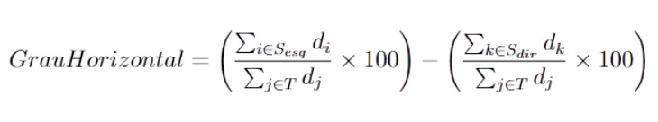
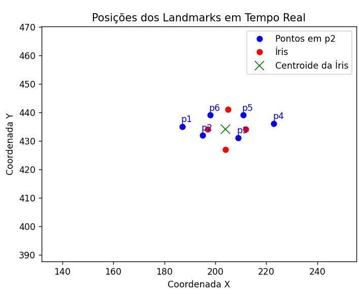
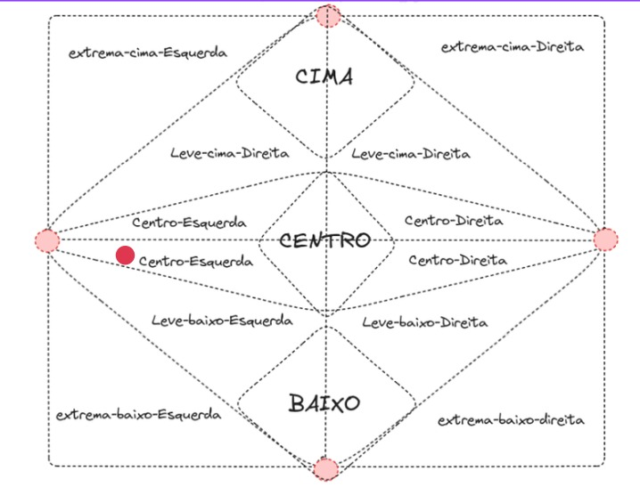
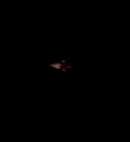

# EyeTeractive: Paraconsistent Logic for Gaze-Based Interfaces

## Overview

The **EyeTeractive** project aims to develop an accessible and efficient gaze-tracking system by leveraging **paraconsistent logic** and **artificial intelligence**. This system translates eye movements into computational commands, providing inclusive solutions for users with physical or motor limitations. By utilizing cost-effective hardware like standard webcams and robust algorithms, the project overcomes the challenges of traditional gaze-tracking technologies.

## Key Features

- **Paraconsistent Logic**: Handles uncertainties and inconsistencies in gaze-tracking data caused by variable lighting and image quality.
- **AI-Powered Processing**: Uses the ResNet architecture and Dlib library for accurate iris detection and gaze direction estimation.
- **Accessibility**: Eliminates the need for expensive hardware like Tobii Eye Trackers, enabling compatibility with low-cost devices.
- **Real-Time Interaction**: Processes and maps gaze movements into actionable commands in real time.

## Motivation

Traditional gaze-tracking solutions often require proprietary hardware that is expensive and not universally accessible. The **EyeTeractive** project addresses these issues by:

1. Reducing dependency on specialized hardware.
2. Enhancing robustness in challenging environments (e.g., variable lighting).
3. Promoting digital inclusion by making the technology accessible to diverse user groups.

## Objectives

### General Objective
- Develop an efficient model to translate gaze positions into computational commands using paraconsistent logic and artificial intelligence.

### Specific Objectives
1. Validate the model's performance under adverse conditions, such as lighting and viewing angles.
2. Ensure scalability and applicability in low-cost devices.

## Methodology

1. **Data Collection**:
   - 7,000+ frames were collected from 27 videos of volunteers at the Federal University of Rondônia.
   - Participants followed a moving circle on a screen to capture gaze data.

2. **Model Development**:
   - Utilized the **Dlib library** for facial landmarks and iris region detection.
   - Trained the model using the **ResNet architecture** for robust classification and detection tasks.
   - Avoided data augmentation to ensure real-world scenario validity.

3. **Paraconsistent Logic Integration**:
   - Applied paraconsistent logic to process and translate gaze data, addressing inconsistencies effectively.
   - Calculated precise gaze directions using horizontal and vertical displacement metrics.

## Visualization

- **Calculating the Horizontal Axis**:
  
  This image illustrates the calculations used to determine the horizontal displacement of the iris.

- **Eye Position Interpretation**:
  
  This graph visualizes the processed interpretation of the eye's position.

- **Adapted Paraconsistent Logic**:
  
  This chart represents the application of adapted paraconsistent logic to interpret gaze directions.

- **Iris Mask Extraction**:
  
  This image shows the segmented mask of the eye region extracted using the Dlib library.

## Applications

- Biometric analysis.
- Eye-based interface control for individuals with motor impairments.
- Behavioral studies using gaze tracking.

## Dependencies

- Python 3.8+
- Dlib
- OpenCV
- TensorFlow or PyTorch (for ResNet implementation)

## Getting Started

1. Clone the repository:
   ```bash
   git clone https://github.com/user/EyeTeractive.git

2. Install Dependencies:
   ```bash
   pip install -r requirements.txt

3. Run the application:
   ```bash
   python main.py

## Team
- Jáder Louis de Souza Gonçalves
- Samih Santos de Oliveira

### Advisor
- Prof. Dr. Lucas Marques da Cunha


